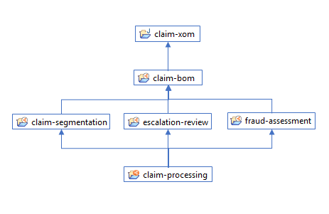
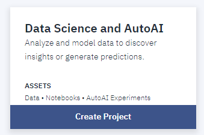
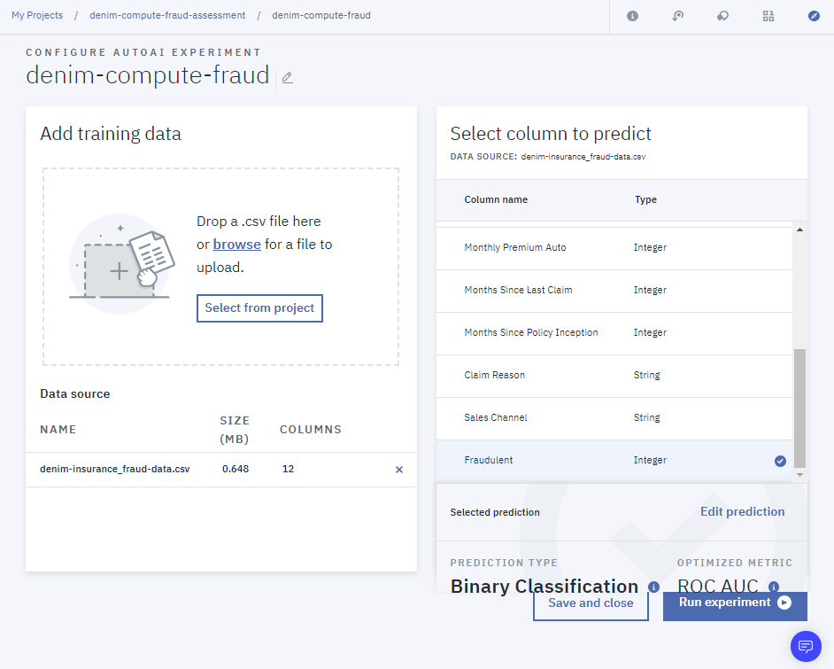
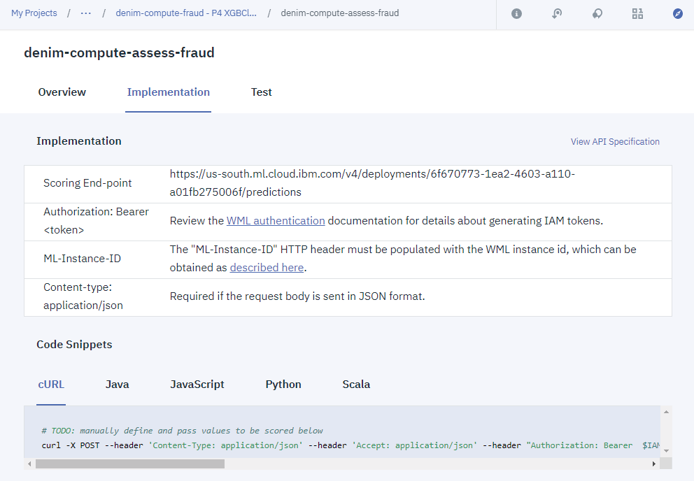
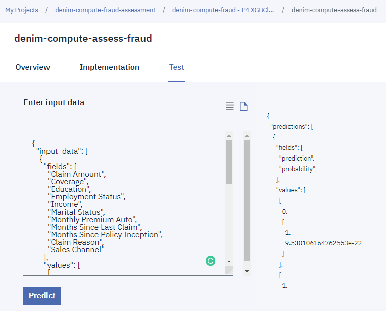

# Business decisions
The claim processing scenario currently involves three rule-based decisions:

- *Perform claim segmentation* which evaluates the information available from the initial claim intake and uses it to compute a complexity score for the claim. This score will be used to route the claim to an adjuster with the right experience or for simple cases, bypass the need to involve the adjuster.

- *Assess fraud potential* is also using the the information from the initial claim intake as well as information available on the driver as well as the policy holder if they are different persons. The decision returns a fraud propensity score that is then used to decide whether a detailed fraud investigation is warranted.

- *Review for escalation* uses information from the claim case to determine whether the claim should be reviewed by the claim manager before a claim settlement is created and proposed to the claimant. It returns a yes/no decision, with a set of justifications when the decision is to escalate.

## <a name="odm-object-model"></a>Object model

The different decision are built using a common object model based on the concepts of Loss, Claim and Policy. A high-level diagram of the input model is shown below:

")

Output of the three decisions is captured by the classes below:

")

## Rule projects

The rule projects are organized as a decision service in a standard fashion, placing the BOM in a separate project that is referenced by the individual rule projects.

Each rule project depending directly on the BOM project is directly associated with a specific decision operation.

The `claim-processing` main project does not contain any rule artifact and is mainly used to define the decision operations and the deployment configuration that will allow the rulesets deployment to the Rule Execution Server.




## Injecting machine learning

The claim fraud assessment decision service is a good candidate to inject a fraud detection service based on a machine learning (ML) model. The typical division of responsibility is that the ML model excels in detecting patterns of fraud, while rules can flag outliers, marginal or heuristic cases that have been detected but do not yet represent a pattern.

**NB**: We are planning to integrate the ML-based scoring model for fraud in a future Denim Compute iteration. For now, we just have a clean set of labeled data (see the [denim-insurance-fraud-data.csv](`https://github.com/ibm-cloud-architecture/denim-compute/source/ml/denim-insurance-fraud-data.csv`) file).

This sample fraud dataset is a good fit for the AutoAI feature of [Watson Studio](https://cloud.ibm.com/catalog/services/machine-learning):



AutoAI will automatically determine a set of ML pipelines that perform well given the dataset and the dependent feature (in our case, the `Fraudulent` column).



- After the experiment execution completes, Watson AutoAI presents the possible pipelines to choose from, each with their associated KPIs.


- Once the desired pipeline is selected, it can be simply operationalized by creating a deployment, which exposes a scoring end-point:



- From there, the scoring service can be manually tested:



Sample input:
```
{
  "input_data": [
    {
      "fields": [
        "Claim Amount",
        "Coverage",
        "Education",
        "Employment Status",
        "Income",
        "Marital Status",
        "Monthly Premium Auto",
        "Months Since Last Claim",
        "Months Since Policy Inception",
        "Claim Reason",
        "Sales Channel"
      ],
      "values": [
        [ 276, "Basic", "Bachelor", "Employed", 56274, "Married", 69, 32, 5, "Collision", "Agent"],
        [ 265, "Basic", "High School", "Unemployed", 0, "Married", 70, 7, "Scratch or Dent", "CallCenter"]
      ]
    }
  ]
}
```

Sample output:
```
{
  "predictions": [
    {
      "fields": [
        "prediction",
        "probability"
      ],
      "values": [
        [ 0, [1, 9.530106164762553e-22]],
        [ 1, [0.0001811385154724121, 0.9998188614845276]]
      ]
    }
  ]
}
```