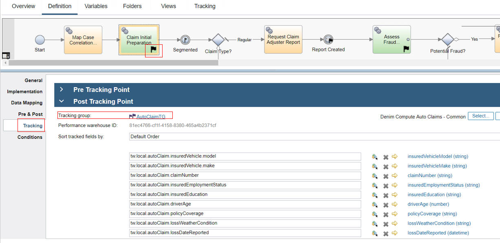
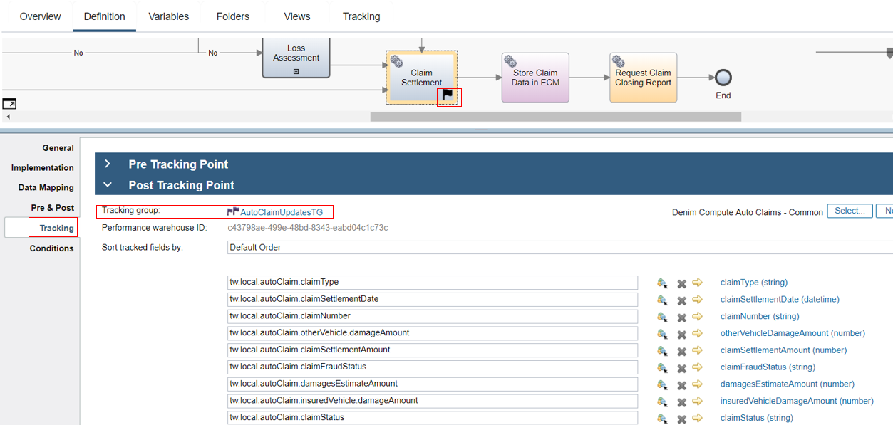
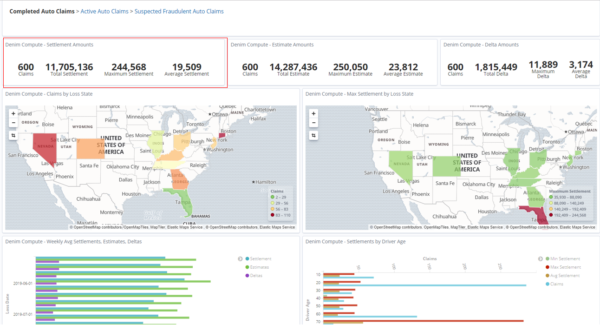
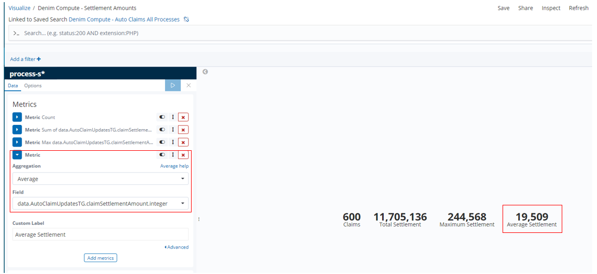
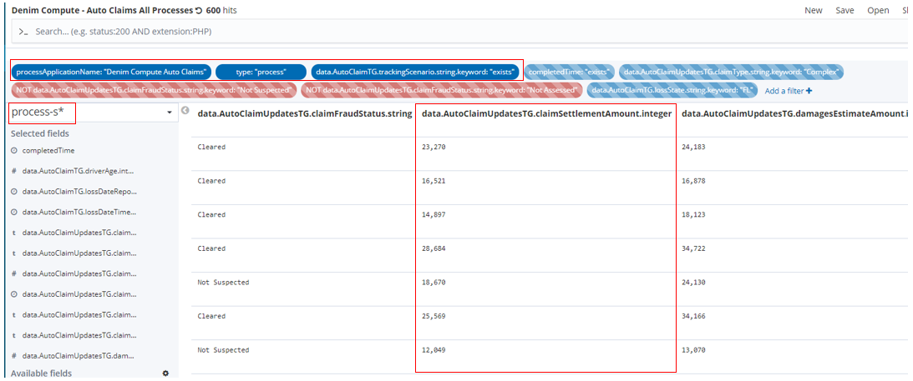

# Operational intelligence  
The [Business Automation Insights](https://www.ibm.com/support/knowledgecenter/SSYHZ8_18.0.x/com.ibm.dba.bai/topics/con_bai_intro.html) (BAI) component provides capabilities to visualize the business events that are generated by an automation solution, as well as feed these events to a data lake so that deeper insights can be derived about the solution, in particular by applying machine learning algorithms to the events.

In the following sections, we describe how BAI is put to work for the different components of the Denim Compute solution.

## ODM dashboard
The Denim Compute implementation uses ODM events collected by BAI to present a Kibana dashboard that shows the distribution of the different business decision outcomes over a period of time.

- For the *claim segmentation* decision, the visualization is the portion of low (green), medium (orange) and high (red) complexity claims processed in past period.

- For *escalation review*, the portion of escalated claims (dark blue) versus the claims that do not need escalation (light blue) is displayed.

- For *fraud assessment*, the fraud median score as well as the maximum score over the past period is displayed.

A sample view of this dashboard is shown below.

The dashboard is created following the steps in [this tutorial](https://github.com/ODMDev/decisions-bai-gettingstarted/blob/master/gs_topics/tut_bai_gs_custom_lsn.md), using the following ODM output parameters fields to build the search:

| Decision | Target Kibana field | BOM attribute |
| -------- | ------------------- | ------------- |
| Assess Fraud | `data.claim_processing.assess_fraud.out.fraud.score` | `FraudAssessment.score` |
| Review Escalation | `data.claim_processing.review_escalation.out.escalation.required` | `EscalationAssessment.required` |
| Segment Claim | `data.claim_processing.segment_claim.out.complexity.complexity` | `ComplexityAssessment.complexity` |

## BAW dashboard
The BAW data sent to BAI as `DEF (Dynamic Event Framework)` events is then visualized on a set of `Kibana Dashboards`, this is illustrated in detail in [BAI scenario walkthrough](../usecase/bai-scenario-walkthrough.md). That scenario shows how to batch load the data in order to see realistic trends in the `Dashboards`, however the concepts are the same for the main scenario described in [Main scenario walkthrough](../usecase/resources/denim-compute-scenario-walkthrough.pdf).

The core concept for sending `DEF` events to BAI is using `Tracking Group` definitions in BAW which emits data of relevance at critical points in the workflow (see [Workflow design](./workflow.md) to familiarise yourself with the workflow). This can be seen in the fragment of `Initiate Claims Processing` below where a selection of the various tracking points are highlighted.

Two different `Tracking Groups` are used in the workflow, one for fairly static data that is available at the start (such as information from the Policy and the First Notice of Loss) and one for data that is dynamically adjusted as the workflow progreses (e.g. the various amounts of estimates and adjustments). Below you can see that the tracking has been configured to use the `Tracking Group` named `AutoClaimTG` and the various state of workflow instance variables are mapped to the corresponding properties of `AutoClaimTG`.

And here we see an example from downstream in the workflow where data updates are available after `Claim Settlement` and they are mapped to the corresponding properties in the `Tracking Group` named `AutoClaimUpdatesTG`.

In the Kibana console you then see the results of those `DEF` events where they are aggregated into `process summaries` and then exposed as various `Visualizations` on a `Dashboard`. In the highlighted example is a specific `Visualization` that shows various aggregated metrics.

Here you can see the definition of that `Visualization` and a specific metric is highlighted where it averages the values from the `claimSettlementAmount` property in  `AutoClaimUpdatesTG`.

The `Visualization` in turn uses an `Elasticsearch Search` shown below. It has various `Filters` applied against the `Index Pattern` named `process-s*` in order to find specific summaries of interest to our scenario. The columns have been configured to highlight the base data that then feeds into the aggregation that calculated the average that we saw previously in the `Visualization`.

For further details on how the BAI integration with BAW was achieved, please see the [Insights](../development/insights.md) development section.