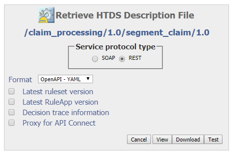

# DBA solution development findings

---

## About BAW

### Process and Case data integration

BAW 19.0.0.1 offers JavaScript facilities (object and associated set of methods) to allow the data integration between Process and Case. These objects and methods allow to transfer case properties into the process and subsequently to save back into the case property data updated.

In processes that implement case activities, you can interact with the JavaScript case operations through the new operations that have been added to the [`TWProcessInstance`](https://www.ibm.com/support/knowledgecenter/en/SS8JB4/com.ibm.wbpm.ref.doc/ae/doc/JSAPI.html#TWProcessInstance) JavaScript API in Business Automation Workflow. Useful methods are:

- `addCommentToParentActivity`
- `addCommentToParentCase`
- `completeParentCaseStage`
- `createCaseUsingSameCaseType`
- `createCaseUsingSpecifiedCaseType`
- `createDiscretionaryActivityInParentCase`
- `createDiscretionaryActivityInParentCaseWithWorkflowParams`
- `createParentCaseDiscretionaryActivityWithProps`
- `createSubfolderUnderParentCase`
- `getParentActivityPropertyNames`
- `getParentActivityPropertyValues`
- `getParentCaseCasePropertyNames`
- `getParentCaseCasePropertyValues`
- `getParentCaseStructure`
- `relateParentCase`
- `searchParentCaseActivities`
- `setParentActivityPropertyValues`
- `setParentCaseCasePropertyValues`
- `unrelateParentCase`

---
### Case properties validation

Case Manager delivers basic property validation OOTB.
For instance, properties are validated according to type and whether they are required or not. Other more complex validation rules, with more complex logic require the implementation of scripts. The claims processing solution implements some of these script-based property validation to showcase the concept.

---

## About ODM

### Integrating multiple decision services based on a common BOM
While ODM rulesets are grouped in a RuleApp deployment artifact, the corresponding service definitions are generated individually for each ruleset, as shown below: 

In our use case, we use one `claim_processing` RuleApp, and we have to generate three separate service definition files, one for each `segment_claim`, `assess_fraud` and `review_escalation`.

Because all three decision services are sharing the same [input object model](../design/decisions.md#odm-object-model), importing these separate service definition files in BAW will create three separate (but identical) versions of the business objects hierarchy.

One solution, using e.g. the YAML definition files, is to rename each `Request` and `Response` definitions in the generated service definition files with a unique name, and then merge the multiple YAML files into a single one that reflects the services exposed by the RuleApp.

---

