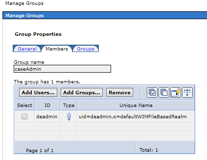

- Add the following content in the file `/etc/security/limits.conf` on all servers:
```
# - stack - maximum stack size (KB)
root soft stack 32768
root hard stack 32768
# - nofile - maximum number of open files
root soft nofile 65536
root hard nofile 65536
# - nproc - maximum number of processes
root soft nproc 16384
root hard nproc 16384
# - fsize - maximum file size
root soft fsize 6291453
root hard fsize 6291453
```

- Execute the scripts in all servers:
```
echo 3000 > /proc/sys/net/core/netdev_max_backlog
echo 3000 > /proc/sys/net/core/somaxconn
echo 15 > /proc/sys/net/ipv4/tcp_keepalive_intvl
echo 5  > /proc/sys/net/ipv4/tcp_keepalive_probes
```

- Unpack the installation files:
```
tar xzvf BAW_18_0_0_1_Linux_x86_1_of_3.tar.gz
tar xzvf BAW_18_0_0_1_Linux_x86_2_of_3.tar.gz
tar xzvf BAW_18_0_0_1_Linux_x86_3_of_3.tar.gz

apt-get install unzip
unzip 8.5.5-WS-WAS-FP015-part1.zip
unzip 8.5.5-WS-WAS-FP015-part2.zip
unzip 8.5.5-WS-WAS-FP015-part3.zip
```

- Install the Installation Manager:
```
cd /downloads/BAW18001/IM64/tools
./imcl install com.ibm.cic.agent -repositories /downloads/BAW18001/IM64/repository.config -installationDirectory /opt/ibm/IM/eclipse -showVerboseProgress -log IM_Installation.log -acceptLicense
```

- Install BAW:
```
cd /opt/ibm/IM/eclipse/tools/
# install BAW 18.0.0.1
./imcl install com.ibm.bpm.ADV.v85,WorkflowEnterprise.NonProduction com.ibm.websphere.ND.v85,core.feature,ejbdeploy,thinclient,embeddablecontainer,samples,com.ibm.sdk.6_64bit -acceptLicense -installationDirectory /opt/IBM/BPM -repositories /downloads/BAW18001/repository/repos_64bit -properties user.wasjava=java8 -showVerboseProgress -log silentinstall.log

# install BAW 19.0.0.1 and WAS 8.5.5.15 fix pack
./imcl install com.ibm.websphere.ND.v85 com.ibm.bpm.ADV.v85,WorkflowEnterprise.NonProduction -acceptLicense -installationDirectory /opt/IBM/BPM -repositories /downloads/WAS85515/repository.config,/downloads/BAW19001/workflow.19001.delta.repository.zip -properties user.wasjava=java8 -showVerboseProgress -log silent_update.txt

# check the installed packages
/opt/IBM/BPM/bin/versionInfo.sh -maintenancePackages
```

- Mount share folder for Case Management on all servers:
```
apt-get install nfs-common
mkdir -p /data/casemanagement
mount {nfs-machine-ip}:/data/casemanagement /data/casemanagement
```

- The sample installation properties file can be found in the folder `/opt/IBM/BPM/BPM/samples/config/advanced/Advanced-PC-ThreeClusters-DB2.properties`.  Create a copy of the properties file, then update server hostname, dbserver connection and set the property `bpm.de.caseManager.networkSharedDirectory` to NFS share folder `/data/casemanagement`.

- Create BAW Deployment manager node profile and node1 profile:
```
cd /opt/IBM/BPM/bin
./BPMConfig.sh -create -de Advanced-PC-ThreeClusters-DB2.properties 
/opt/IBM/BPM/profiles/DmgrProfile/bin/startManager.sh
/opt/IBM/BPM/profiles/Node1Profile/bin/startNode.sh
```

- Create BAW node2 profile:
```
cd /opt/IBM/BPM/bin
./BPMConfig.sh -create -de Advanced-PC-ThreeClusters-DB2.properties 
/opt/IBM/BPM/profiles/Node2Profile/bin/startNode.sh
```

- Create database:
The DB scripts can be found in `/opt/IBM/BPM/profiles/DmgrProfile/dbscripts`
```
db2 -stf CMNDB-Cell/createDatabase.sql

db2 connect to CMNDB
db2 -tvf CMNDB-Cell/createSchema_Advanced.sql
db2 -tvf CMNDB/createSchema_Advanced.sql
db2 -tvf CMNDB/createSchema_Messaging.sql
db2 connect reset

db2 -stf BPMDB/createDatabase.sql
db2 connect to BPMDB
db2 -tvf BPMDB/createSchema_Advanced.sql
db2 -tdGO -vf BPMDB/createProcedure_Advanced.sql
db2 connect reset

db2 -stf PDWDB/createDatabase.sql
db2 connect to PDWDB
db2 -tvf PDWDB/createSchema_Advanced.sql
db2 connect reset

mkdir -p /home/db2inst1/db2inst1/CPEDB/DOSSA/datafs1
mkdir -p /home/db2inst1/db2inst1/CPEDB/DOSSA/datafs2
mkdir -p /home/db2inst1/db2inst1/CPEDB/DOSSA/datafs3
mkdir -p /home/db2inst1/db2inst1/CPEDB/DOSSA/indexfs1
mkdir -p /home/db2inst1/db2inst1/CPEDB/DOSSA/indexfs2
mkdir -p /home/db2inst1/db2inst1/CPEDB/DOSSA/lobfs1
mkdir -p /home/db2inst1/db2inst1/CPEDB/TOSSA/datafs1
mkdir -p /home/db2inst1/db2inst1/CPEDB/TOSSA/datafs2
mkdir -p /home/db2inst1/db2inst1/CPEDB/TOSSA/datafs3
mkdir -p /home/db2inst1/db2inst1/CPEDB/TOSSA/indexfs1
mkdir -p /home/db2inst1/db2inst1/CPEDB/TOSSA/indexfs2
mkdir -p /home/db2inst1/db2inst1/CPEDB/TOSSA/lobfs1
mkdir -p /home/db2inst1/db2inst1/CPEDB/sys
mkdir -p /home/db2inst1/db2inst1/CPEDB/systmp
mkdir -p /home/db2inst1/db2inst1/CPEDB/usr
mkdir -p /home/db2inst1/db2inst1/CPEDB/log

chmod -R 777 /home/db2inst1/db2inst1/CPEDB

# replace @DB_DIR@ with /home/db2inst1/db2inst1 in CPEDB/createDatabase_ECM.sql and CPEDB/createTablespace_Advanced.sql
db2 -stf CPEDB/createDatabase_ECM.sql
db2 connect to CPEDB
db2 -tvf CPEDB/createTablespace_Advanced.sql
db2 connect reset
db2 connect to CPEDB
db2 -tvf CPEDB/createSchema_Advanced.sql
db2 connect reset
```

- Bootstrap Process Server Data:
```
/opt/IBM/BPM/profiles/DmgrProfile/bin/bootstrapProcessServerData.sh -clusterName AppCluster
```

- Create a group `caseAdmin` in the WAS Admin console, and assign `deadmin` to the group.



- Create the Object Store for Case Management:
```
/opt/IBM/BPM/profiles/DmgrProfile/bin/wsadmin.sh -user deadmin -password deadmin -host dbamc-icp-ubuntu-baw3.csplab.local -port 8880 -lang jython
print AdminTask.createObjectStoreForContent(['-clusterName', 'AppCluster', '-PEWorkflowSystemAdminGroup', 'caseAdmin','-creationUser','deadmin','-password','deadmin'])
```

- Update connection timeout setting to at least 600 seconds in the WAS Admin console:
```
* Servers > Server Types > WebSphere application servers > Configuration tab > Container Settings > Container Services > Transaction service > Total transaction lifetime timeout
* Servers > Server Types > WebSphere application servers > Configuration tab > Container Settings > Container Services > Transaction service > Maximum transaction lifetime timeout
* Servers > Server Types > WebSphere application servers > Configuration tab > Container Settings > Container Services > ORB service > Request timeout
* Servers > Server Types > WebSphere application servers > Configuration tab > Container Settings > Container Services > ORB service > Locate request timeout
* Resources > JDBC > Data sources > [Content Engine or Case Manager data source name] > Connection Pool properties > Connection timeout
* Resources > JDBC > Data sources > [Content Engine or Case Manager XA data source name] > Connection Pool properties > Connection timeout
```

- Configure Case Management profile:
```
## Register the Administration Console for Content Platform Engine (ACCE) Plug-in
/opt/IBM/BPM/CaseManagement/configure/configmgr_cl execute -task registeracceplugin -profile /opt/IBM/BPM/profiles/DmgrProfile/CaseManagement/De1/profiles/ICM_dev/ICM_dev.cfgp

## Configure the Case Management Object Stores
/opt/IBM/BPM/CaseManagement/configure/configmgr_cl execute -task configcmos -profile /opt/IBM/BPM/profiles/DmgrProfile/CaseManagement/De1/profiles/ICM_dev/ICM_dev.cfgp

## Define the Default Project Area
/opt/IBM/BPM/CaseManagement/configure/configmgr_cl execute -task definedefaultprojectarea -profile /opt/IBM/BPM/profiles/DmgrProfile/CaseManagement/De1/profiles/ICM_dev/ICM_dev.cfgp

## Configure Case Integration with IBM Business Automation Workflow
/opt/IBM/BPM/CaseManagement/configure/configmgr_cl execute -task configibmbpm -profile /opt/IBM/BPM/profiles/DmgrProfile/CaseManagement/De1/profiles/ICM_dev/ICM_dev.cfgp

## Deploy the Content Platform Engine Workflow Service
/opt/IBM/BPM/CaseManagement/configure/configmgr_cl execute -task deployibmbpmis -profile /opt/IBM/BPM/profiles/DmgrProfile/CaseManagement/De1/profiles/ICM_dev/ICM_dev.cfgp

## Register the IBM Business Automation Workflow Plug-in
/opt/IBM/BPM/CaseManagement/configure/configmgr_cl execute -task registerbawplugin -profile /opt/IBM/BPM/profiles/DmgrProfile/CaseManagement/De1/profiles/ICM_dev/ICM_dev.cfgp

## Register the Case Management Services Plug-in
/opt/IBM/BPM/CaseManagement/configure/configmgr_cl execute -task registerservices -profile /opt/IBM/BPM/profiles/DmgrProfile/CaseManagement/De1/profiles/ICM_dev/ICM_dev.cfgp

## Register the Case Widgets Package
/opt/IBM/BPM/CaseManagement/configure/configmgr_cl execute -task registercaseclient -profile /opt/IBM/BPM/profiles/DmgrProfile/CaseManagement/De1/profiles/ICM_dev/ICM_dev.cfgp

## Register the IBM Business Automation Workflow Case Administration Client Plug-in
/opt/IBM/BPM/CaseManagement/configure/configmgr_cl execute -task registeradmin -profile /opt/IBM/BPM/profiles/DmgrProfile/CaseManagement/De1/profiles/ICM_dev/ICM_dev.cfgp

## Register Project Area
/opt/IBM/BPM/CaseManagement/configure/configmgr_cl execute -task registerprojectarea -profile /opt/IBM/BPM/profiles/DmgrProfile/CaseManagement/De1/profiles/ICM_dev/ICM_dev.cfgp

## Configure Business Rules
/opt/IBM/BPM/CaseManagement/configure/configmgr_cl execute -task configrules -profile /opt/IBM/BPM/profiles/DmgrProfile/CaseManagement/De1/profiles/ICM_dev/ICM_dev.cfgp

## Register the Case Monitor Widgets Package
/opt/IBM/BPM/CaseManagement/configure/configmgr_cl execute -task registericmmonitor -profile /opt/IBM/BPM/profiles/DmgrProfile/CaseManagement/De1/profiles/ICM_dev/ICM_dev.cfgp
```

- Enable BAI event
```
/opt/IBM/BPM/profiles/DmgrProfile/bin/wsadmin.sh -user deadmin -password deadmin -f /opt/IBM/BPM/BPM/Lombardi/tools/def/EnableBAI.py --enable
/opt/IBM/BPM/profiles/DmgrProfile/bin/wsadmin.sh -conntype none -profileName DmgrProfile -f /opt/IBM/BPM/ProcessChoreographer/admin/setStateObserver.py -cluster AppCluster -enable DEF
```

- Restart the BAW server

- The sample BAI configuration file is in the path `/opt/IBM/BPM/BPM/Lombardi/tools/def/BAIConfigure.properties`, update it and then execute:
```
/opt/IBM/BPM/profiles/DmgrProfile/bin/wsadmin.sh -user deadmin -password deadmin -f /opt/IBM/BPM/BPM/Lombardi/tools/def/EnableBAI.py --update=connection --property="/root/baw/BAIConfigure.properties"
```

- Restart the BPMEventEmitter application from WAS admin console.
 