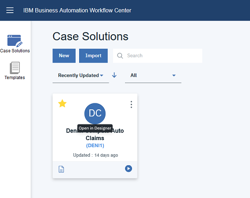
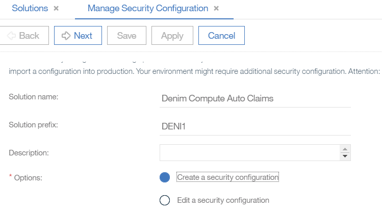
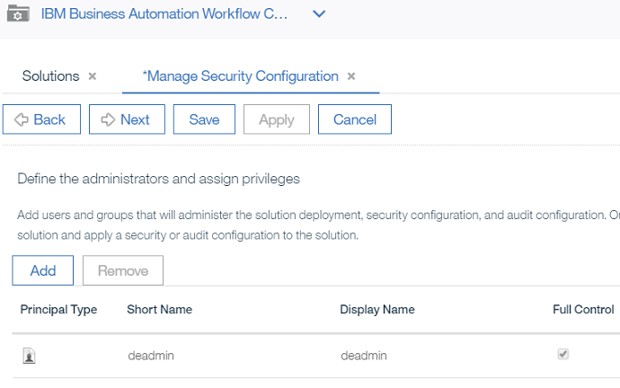
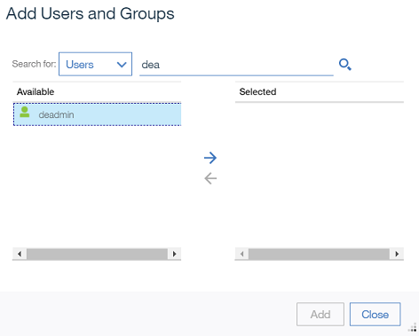
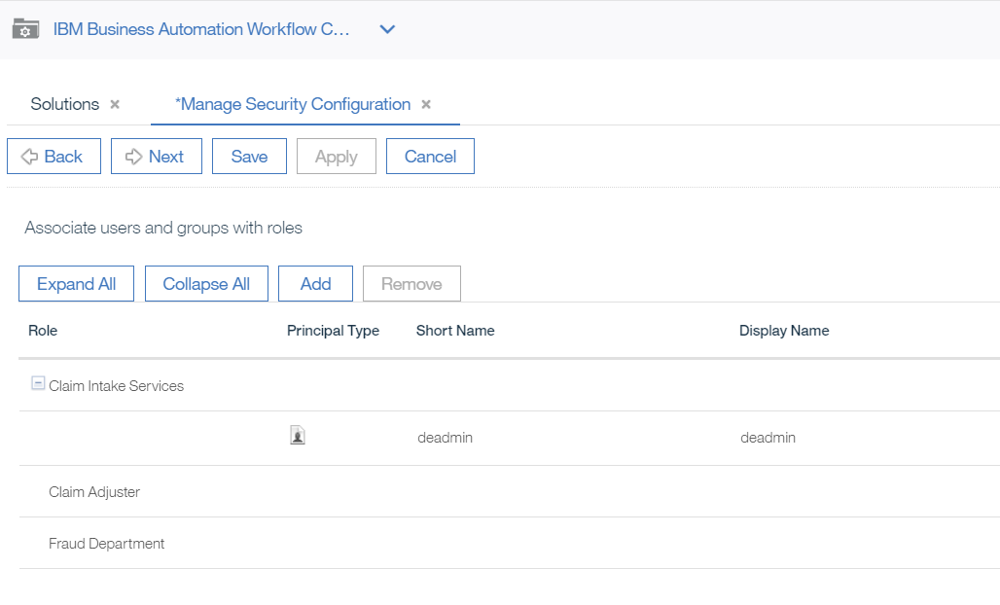
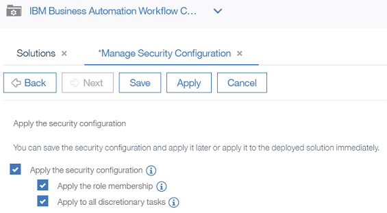
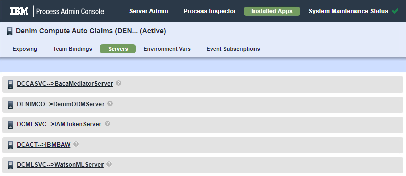
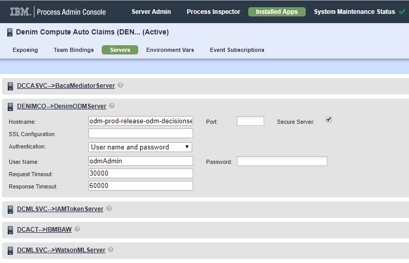

# Running the solution

## Deploy the case solution in Workflow Center
- Login to Workflow Center and open the Case Solution named `Denim Compute Auto Claims`:

- Click the deploy icon in the upper-right corner of the Case Builder:

##Create Case security configuration

- In the `Workflow Center`select the solution and click the contextual menu and then `Advanced`.

- With the `Denim Compute` solution selected click `Actions`, then `Manage` and then `Security Configuration`.

- Select the option to `Create a security configuration` and click `Next`.

- Provide a `Security manifest name` and click `Next`.

- Set permissions against the security `Roles` (in this example all permissions are assigned to each `Role`) and click `Next`.

- You can then set the adminstrators, if you want you can `Add` others.

- In the `Add Users and Groups` modal dialogue you can add users or groups. You start typing partial names and then click the magnifying glass icon to find matching users that appear in the `Available` section. You can then use the arrows to move between `Available` and `Selected` and when done you click `Add` to complete. When done with this section click `Next` to continue.

- Next you map groups and users to the Case `Roles`. Select each `Role` and click `Add` then follow the earlier instructions for how to find and assign users and groups.

- In this example we have just added a default user to the `Claim Intake Services` `Role`. You repeat these steps for the other `Roles`.

- Here is the final situation were example users are added to each `Role` (if you want a more realistic scenario you should setup different users and groups and assign them to the `Roles`). Click `Next` when done with this section.

- Now you can check the box next to `Apply the security configuration` and click `Apply`.

- You should get confirmation that the security configuration was successfully applied (you can then `Close` this dialog).

- Note if you ever need to review or change the security configuration settings you can launch it again and choose the `Edit a security configuration` option as shown here.

##Create BPM user groups

- The solution has a number of BPM `Teams` defined that need to map to users and groups. To do that launch the `Process Admin Console` and then select `Server Admin` section. Within that select `User Management` and `Group Management` and type `denim` in `Select Group to Modify` and you should see the groups that have been created as a result of the `Team` definitions.

- You then need to assign users and groups for your environment against those pre-defined groups. Here is an example were we have assigned a number of users to the `denim-adjusters` group.

##Configure servers 

- The solution integrates to ODM and ECM by using defined `Servers`. By default these are mapped to the environment the IBM team used in testing. You have to now re-map these to your own environment based on how you configured it in the [Environment](../../environment/intro) section. To do this you must first ensure the deployed BAW solition is activated. Select it in `Workflow Center` and click the `View Details` icon in the lower left corner of the tile.

- Next choose the `Snapshots` section, select your snapshot and from the contextual menu you `Activate` it.

- After this you can now go to the `Process Admin Console` and you should see the snapshot in the list of `Installed Apps`.

- You click on the snapshot and then select the `Servers` section and you should see the two server definitions used (`DenimODMServer` for the referenced ODM Sever and `IBMBAW` for the referenced ECM server).

- You should change the settings for the respective servers to match how you installed your environment (the `Hostname`, `Port` and user credentials need to be configured).

