# BACA scenario walkthrough

## Introduction
This scenario builds on the [Main scenario](/usecase/resources/denim-compute-scenario-walkthrough.pdf). It follows an alternate path whereby, instead of a Repairer interacting with the Process Portal to submit a repair estimate, they send it in a PDF document which is then detected and sent to Business Automation Content Analyzer (BACA) for processing. BACA identifies relevant content based on a modeled ontology.

Business Automation Workflow (BAW) interacts with BACA in this scenario via an intermediary microservice (implemented in Node.js) deployed on the OCP cluster.

## Scenario installation
You should have:

- Installed the Cloud Pak for Automation as instructed in the various installation guidance documents in the [OpenShift](/environment/rhos-intro/) environment section.

- Followed the instructions in [Showtime Deploy](/showtime/deploy-solution/) and [Showtime Run](/showtime/run-solution/) to deploy and configure the BAW, BACA and Node.js microservice solutions.

- Downloaded the two PDF documents from [this](https://github.com/ibm-cloud-architecture/denim-compute/solution/baca) directory.

## Scenario starting point

As this scenario builds on the [Main scenario](/usecase/resources/denim-compute-scenario-walkthrough.pdf), it is recommended that a reader familiarises themselves with that first. In that document repair estimates are solicited from 4 repair shops (page 36) and we see work items in the BAW Process Portal.

We are going to show that one of those repair shops (highlighted below) will in parallel send a PDF that will be automatically processed by BACA, and if successful, then the work item in `Process Portal` will be cancelled.
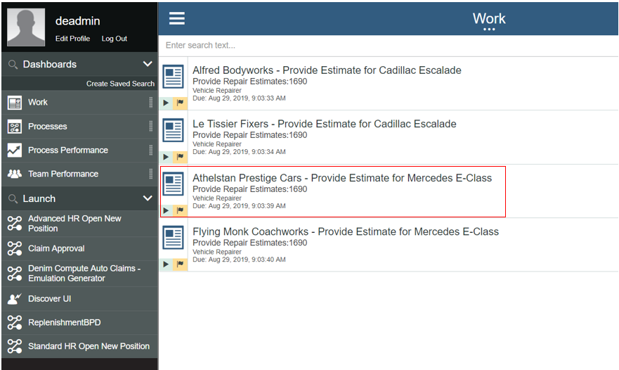

As the scenario is going to interact with a Node.js microservice deployed to OCP, we first will look at the deployed component, here we see inside the `baca-mediator-app` project that there is a `Deployment Config` named `rhocp-baca-mediator`.

The deployment config references a Kubernetes pod shown below.

Selecting the pod and then the Logs section shows the output of the container, and in this case shows that the microservice is initialised and awaiting requests.

## Upload invalid estimate PDF
We are going to demonstrate first with a deliberately malformed PDF of an estimate which does not follow agreed conventions and will not be able to result in it being parsed into a valid estimate that can be processed.

In the `BAW Case Client` a Case worker searches on the `Insured LName` and finds the relevant in-progress Case instance (in this example there are several for a policy holder named `Simmons`). They then click on it to open the `Case Summary` page.

They next go to the `Documents` tab and select the target folder `Repair Estimates and Invoices` as shown below.
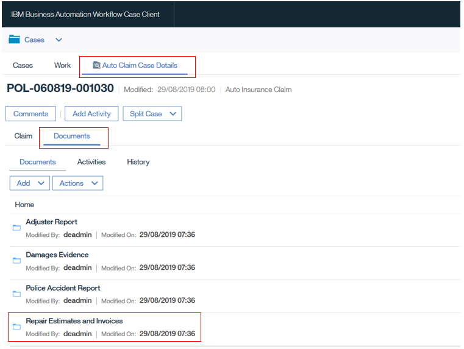

This takes them to the target folder where they will upload a received PDF (we can imagine they got this via email, note it is out of scope for our scenario but there are automatic capabilities in BAW ECM to configure event handlers to automatically detect documents and move them to a defined folder location).
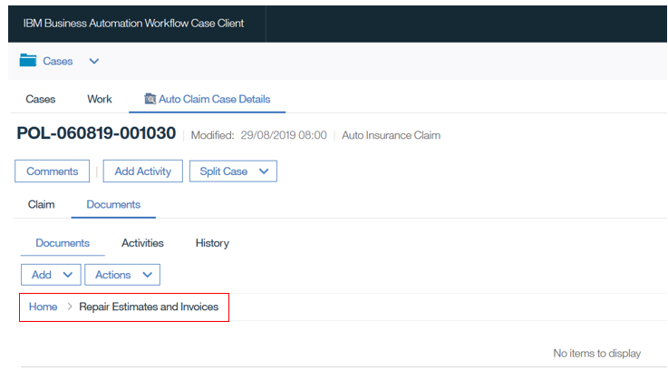

The Case worker will now upload using the `Add Document from Local System` option within the target folder as shown here.
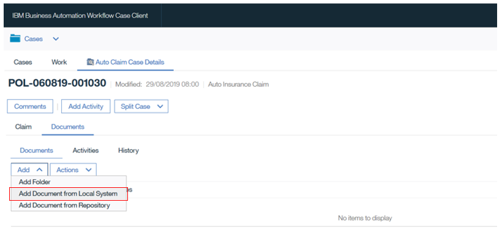

In the document upload dialog, the worker chooses the `Auto Repair Estimate Document Class` which then displays a list of metadata properties (please ignore the `Claim Number` option - this is due to an issue in the test environment were it retained an older reference from an earlier version of the `Document Class` definition). They browse and select the file named `error-estimate-example1.pdf` and ensure they choose the matching `Vehicle VIN` and `Repairer Code`. When happy with the selections, clicking `Add` will complete the upload. 

At this point we want to examine how BAW detects the uploaded document for the defined `Auto Repair Estimate Document Class` and starts processing it. In the Process Admin Console, we go to the `Process Inspector` where we can see that an instance of `Process Repair Estimate` has been started.
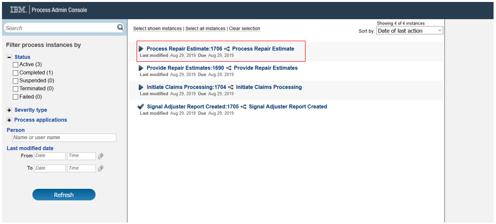

That process in turn invokes the microservice and we can see the log outputs of that interaction back in OCP for the pod, as shown below. If you examine that output closely you will see that several of the debugging log outputs show that some data has invalid values.
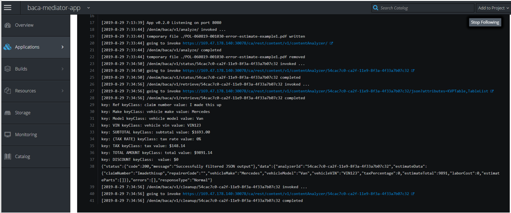

If we now access the BAW Process Portal, we can see that a new work item has been created named `Display Vehicle Estimate Errors`. In the process it detects when it cannot process the uploaded PDF correctly to arrive at a valid estimate and so creates this work item to report on it.
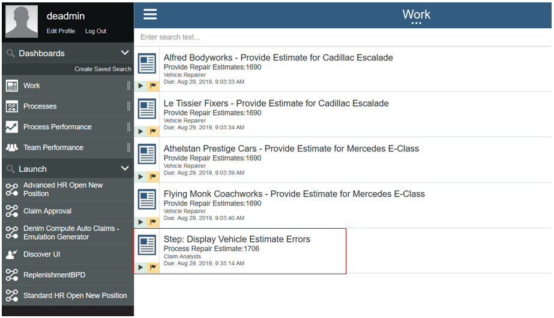

The work item shows a simple error message to highlight what went wrong and displays the PDF that was attempted to be processed. You can see from that PDF that it has some invalid data.

Scrolling further down the document you can see that the table representing vehicle parts has been badly formatted and has inconsistent data that cannot be interpreted into a meaningful set of data that would constitute a valid estimate. The user can now click `Complete` to dismiss this report and we will next show the scenario when a valid estimate is uploaded.
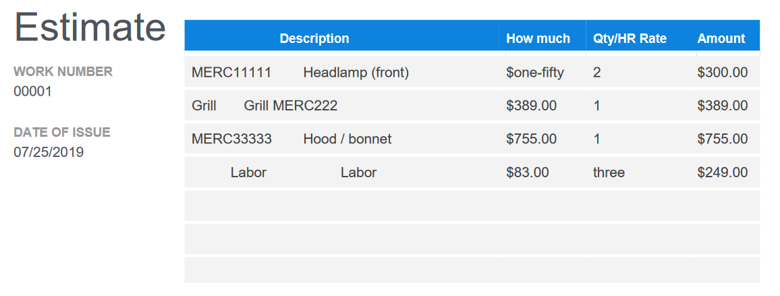

## Upload valid estimate PDF
Having seen the principles behind the scenario, we can now look at the "happy path". This time the case worker selects the valid document `apcars-estimate-example1.pdf` to add to the target folder (`Repair Estimates and Invoices`).
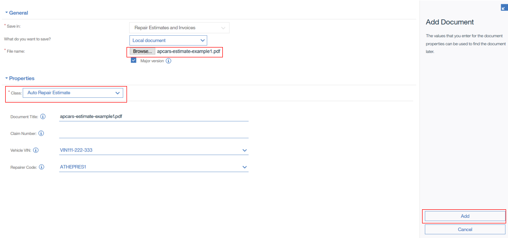

In Process Inspector, we can observe that a second instance of `Process Repair Estimate` has executed and this time it has completed. We can also see highlighted the event data that has been extracted from the document by the combination of the mediator microservice and BACA.

This is then used to send an interrupting event to the instance of the process that is awaiting the completion of the earlier work item for this specific repairer. (Note you can also look again at the OCP logs for the pod and see the fresh debugging output for this newly uploaded PDF).
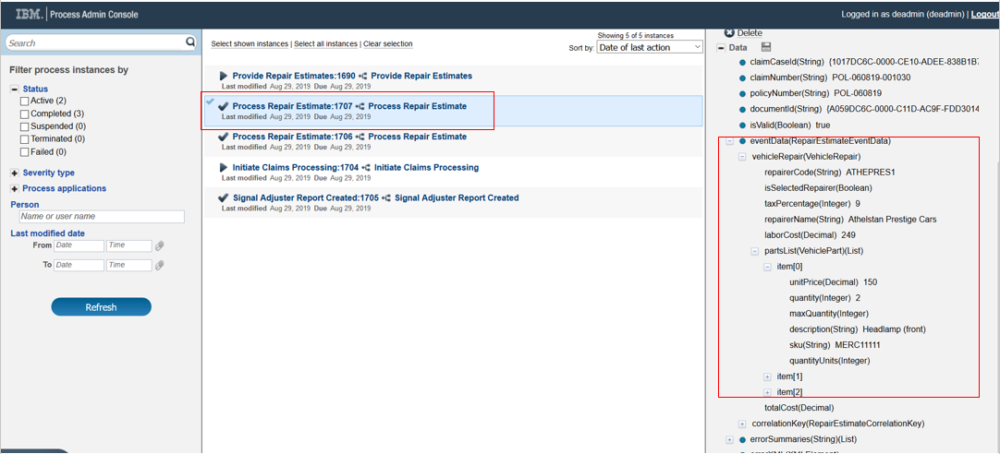

And finally, to verify that this has happened, in BAW Process Portal, we can see that the list of work items refreshes and the one for `Athelstan Prestige Cars` is no longer there. At this point the [Main scenario](/usecase/resources/denim-compute-scenario-walkthrough.pdf) would continue from page 44.
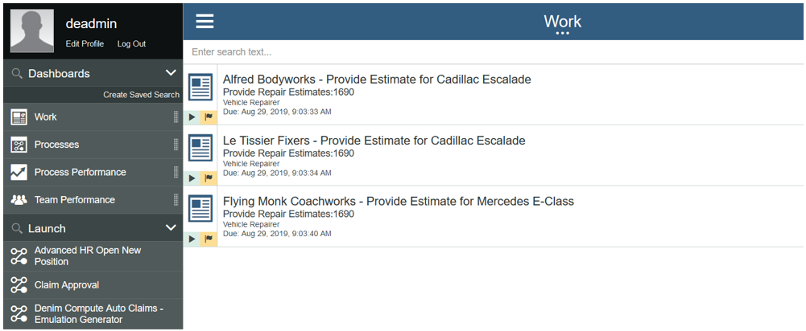

So now we have seen the interaction between BAW and BACA via a mediator microservice deployed on OCP.